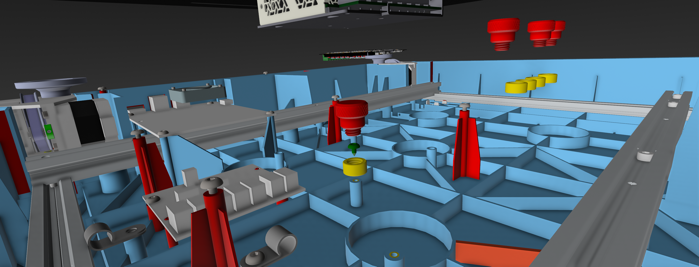
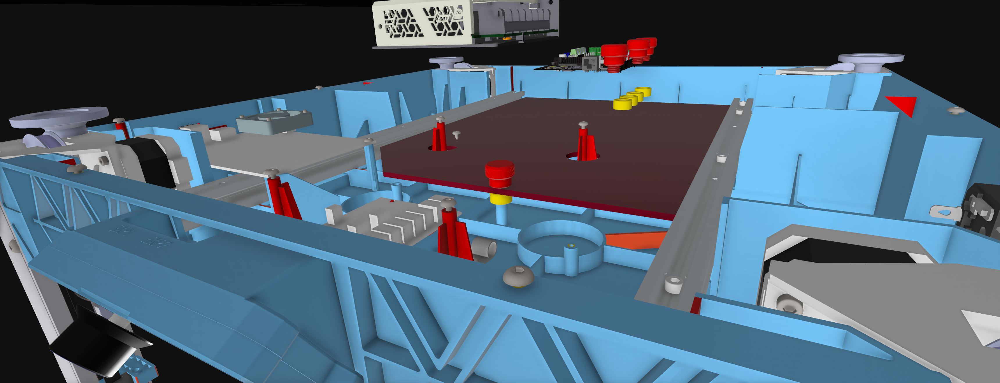
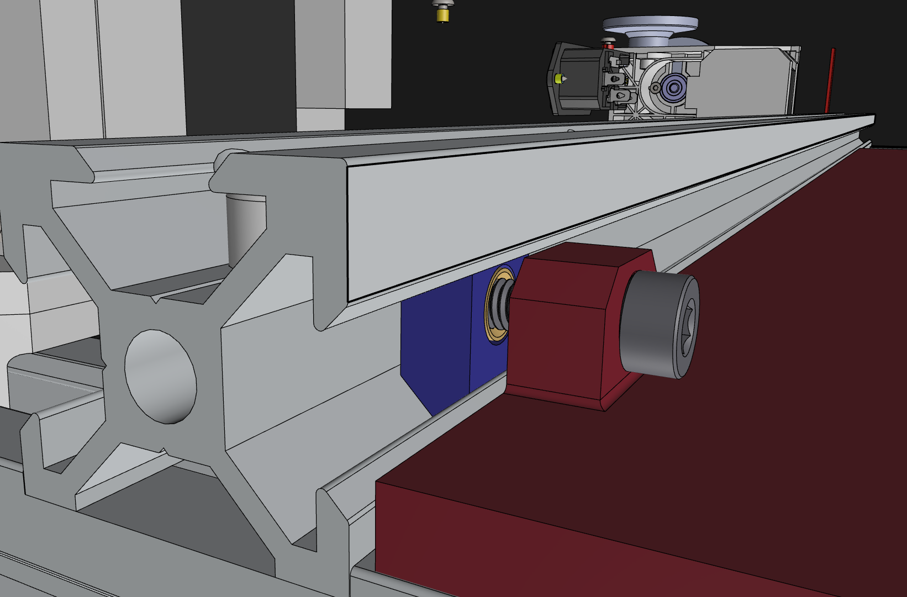
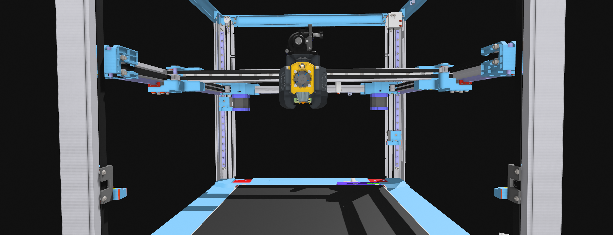
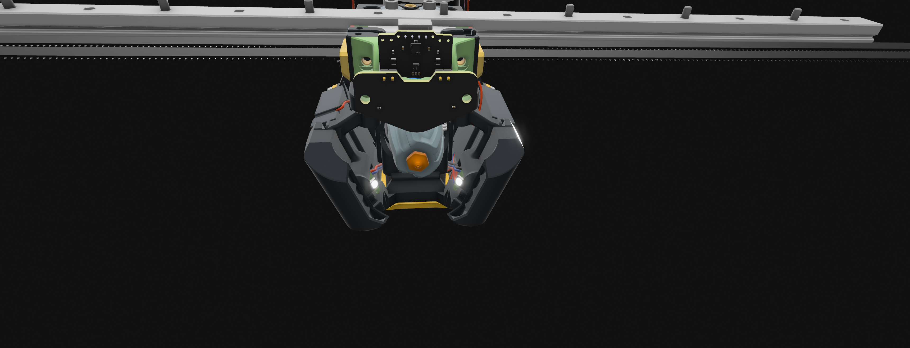

# SV08 MODDING.
## Overview

**XOL-toolhead with a cartographer probe.** 

Below is the setup i picked to run with.

|   Received   |  Hardware |    Link    |
|:-------------|-----------|------------|
| :x:   | Probe/scanner| [Cartographer3D](https://cartographer3d.com/products/copy-of-cartographer-probe-v3-with-adxl345-standard-edition-both-can-usb) |
| ✅   |Toolboard | [Ebb36 V1.2](https://github.com/bigtreetech/EBB) |
| ✅   | Extruder| [Orbiter 2.0](https://www.orbiterprojects.com/orbiter-v2-0) |
| ✅   | Hotend| [Rapido Hotend 2 UHF](https://www.phaetus.com/products/rapido2?variant=45177211257109) |
| ✅   |Mainboard | [BTT MANTA M8P](https://biqu.equipment/products/manta-m4p-m8p) |
| ✅   | CB2 board| [CB2](https://github.com/bigtreetech/cb2) |
| ✅   |Fans, Hw-kit, RGBW |[Replimat](https://www.replimat.eu/projects/xol)      |
 
 

*Under consideration* 
|   Hardware     | Link |
|:-------------|-----------|
|Nozzle cam    | [TBD](https://github.com/3DO-EU/Enclosure-Nozzle-Camera-V2) |
|Stealthchanger | [TBD](https://github.com/DraftShift/StealthChanger) |

## Status:
<ul>
 ✅<b><mark><s> - Print all parts for the toolhead </s></mark></b> 
 ✅ <mark><s>- Need to fix a mount for cartographer </s></mark>  
 <b>- Waiting for all parts to arrive.</b> 
<b> - Realized i forgot to order nepixel and wire :bowtie: </b>b>
 
 
 
<b> - Started working on some ideas i have regarding a mount-plate for electronics </b></ul>  
 
<kbd></kbd> <kbd></kbd>  
<kbd></kbd>
 
## 
### 
 The toolhead will look something like this when it´s done
   
  <kbd></kbd> <kbd></kbd>
  
  

**Armchair-Heavy-Industries** 
[Multiple configurations to choose from](https://github.com/Armchair-Heavy-Industries)

## Contributing
Feel free to open issues or submit pull requests for further improvements.

## License
This project is licensed under the GNU GPLv3 license.
